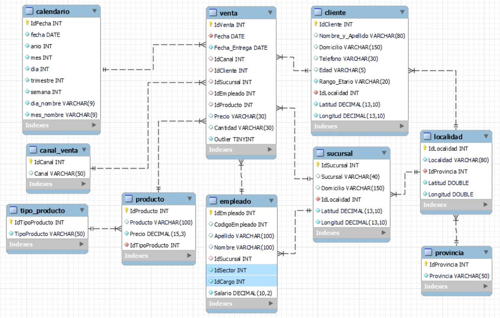

# Checkpoint - Módulo 3

Cómo responder: <br>
* Cuando se pida una respuesta numérica, redondear al segundo decimal. <br>
   Ejemplo: 1.3421 -> 1.34;<br>
            1.8888 -> 1.89;<br>
            3 -> 3.00.<br>

* Recuerda resolver los problemas de manera secuencial y pensar las consultas por partes. Además te resultará útil pensar di debes reutilizar la lógica de consulta de otro ejercicio.<br>

## Responder Verdadero ó Falso

### 1) Un índice SQL es una tabla de búsqueda rápida para poder encontrar los registros que los usuarios necesitan buscar con mayor frecuencia.
```SQL
	VERDADERO
```

### 2) La regla de las 3 sigmas para detección de Outliers está basada en la Mediana.
```SQL
	FALSO
```
### 3) Las tablas Maestros registran las operaciones ocurridas, todo tipo de transacciones donde intervienen las diferentes entidades del modelo.
```SQL
	FALSO
```

## Elegir la opción correcta en base a la observación del siguiente DER:



### 4) ¿Cuál de las siguientes no es una tabla que representa una dimensión?
   1- cliente<br>
   2- calendario<br>
   3- venta<br>
   4- provincia<br>
```SQL
	VENTA
```
   
### 5) El DER presentado...
   1- es un Modelo Estrella, porque tiene una sóla tabla de hechos.<br>
   **2- no es un Modelo Estrella, ya que contiene referencias circulares.**<br>
   3- es un Modelo Copo de Nieve.<br>

## Resuelve los siguientes ejercicios:

### En tu motor de base de datos MySQL, ejecutá las instrucciones del script 'Checkpoint_Create_Insert.sql' (Si no trabajas con MySQL es posible que tengas que realizar algunos ajustes en el script. También están provistas las tablas en formato csv dentro de la carpeta 'tablas_cp').

### 6) La ganancia neta por sucursal es las ventas menos los gastos (Ganancia = Venta - Gasto) ¿Cuál es la sucursal con mayor ganancia neta en 2020? 
#### Elige la opción correcta:
   1- Alberdi<br>
   2- Flores<br>
   3- Corrientes<br>
```SQL
select s.Sucursal,sum(v.Precio*v.Cantidad-g.Monto) as Ganancia from venta as v
join sucursal as s on s.IdSucursal=v.IdSucursal
join gasto as g on g.IdSucursal = s.IdSucursal
WHERE year(v.Fecha)=2020
group by s.Sucursal
order by Ganancia desc
-- FLORES--189334397.130
```
   
### 7) La ganancia neta por producto es las ventas menos las compras (Ganancia = Venta - Compra) ¿Cuál es el tipo de producto con mayor ganancia neta en 2020?
#### Elige la opción correcta:  **corregir**
   1- Informática<br>
   2- Impresión<br>
   3- Grabacion<br>
```SQL
create temporary table ventas  (select IdProducto,sum(precio*Cantidad) as Venta from venta where year(Fecha)=2020 group by IdProducto);
create temporary table compras (select IdProducto,sum(precio*Cantidad) as Compra from compra where year(Fecha)=2020 group by IdProducto);

select v.IdProducto,tp.TipoProducto,(v.Venta-c.Compra) as GananciaNeta from ventas as v
join compras as c on v.IdProducto=c.IdProducto
join producto as p on v.IdProducto=p.IdProducto
join tipo_producto as tp on tp.IdTipoProducto=p.IdTipoProducto
order by GananciaNeta desc;
-- Informatica
```
   
### 8) Del total de clientes que realizaron compras en 2020 ¿Qué porcentaje lo hizo sólo en una única sucursal?
```SQL
set @total := (select count(*) from (select IdCliente,IdSucursal,year(Fecha) from venta where year(Fecha)=2020 group by IdCliente) as t);

set @parcial := (select count(*) from (select t.IdCliente,count(t.IdCliente) as CantidadSucursales 
from (select IdCliente,IdSucursal from venta where year(Fecha)=2020 group by IdCliente,IdSucursal) as t
group by t.IdCliente having CantidadSucursales=1) as f);

select (@parcial/@total)*100
-- 33.71
```


### 9) Del total de clientes que realizaron compras en 2020 ¿Qué porcentaje no había realizado compras en 2019?
```SQL
set @solo2020 := (select count(*) from (select IdCliente,year(Fecha) as Año from venta where year(Fecha)=2020 group by IdCliente,year(Fecha)
having not IdCliente in (select IdCliente from venta where year(Fecha)=2019 group by IdCliente,year(Fecha))) as v);

set @total2020 := (select count(*) from (select IdCliente,year(Fecha) as Año from venta where year(Fecha)=2020 group by IdCliente,year(Fecha)) as v2);

select (@solo2020/@total2020)*100;
-- 40.7867
```


### 10) Del total de clientes que realizaron compras en 2019 ¿Qué porcentaje lo hizo también en 2020?
```SQL
set @total2019 := (select count(*) from (select IdCliente,year(Fecha) as Año from venta where year(Fecha)=2019 group by IdCliente,year(Fecha)) as v);
set @tambien2020 := (select count(*) from (select IdCliente,year(Fecha) as Año from venta where year(Fecha)=2019 group by IdCliente,year(Fecha) having IdCliente in
(select IdCliente from venta where year(Fecha)=2020 group by IdCliente,year(Fecha))) as v);
select (@tambien2020/@total2019)*100;
--- 85.4241
```


### 11) ¿Qué cantidad de clientes realizó compras sólo por el canal OnLine entre 2019 y 2020?
```SQL

select count(*) from (select IdCanal,IdCliente from venta where year(Fecha) in(2019,2020) and IdCanal=2 group by IdCliente 
having not IdCliente in(select IdCliente from venta where year(Fecha) in(2019,2020) and IdCanal in(1,3) group by IdCliente)) as t
-- 564
```
### 12) ¿Cuál es la sucursal que más Venta (Precio * Cantidad) hizo en 2020 a clientes que viven fuera de su provincia?
#### Elige la opción correcta:
   1- Córdoba Quiroz<br>
   2- San Justo<br>
   3- Bariloche<br>
```SQL
select v.IdSucursal,sum(v.Precio*v.Cantidad) as Ventas from venta as v
inner join cliente as c on c.IdCliente = v.IdCliente
inner join localidad as l on l.IdLocalidad = c.IdLocalidad
where concat('(',round(c.Latitud,3),',',round(c.Longitud,3),')') <> concat('(',round(l.Latitud,3),',',round(l.Longitud,3),')') and year(v.Fecha)=2020
group by v.IdSucursal order by Ventas desc;
-- FLORES
```
### 13) ¿Cuál fué el mes del año 2020, de mayor crecimiento con respecto al mismo mes del año 2019 si se toman en cuenta a nivel general Ventas (Precio * Cantidad) - Compras (Precio * Cantidad) - Gastos? 
#### Responder el Número del Mes:
```SQL
create temporary table venta2020 (select year(Fecha) as Anio,month(Fecha) as Mes,sum(Precio*Cantidad) as Total from venta where year(Fecha)=2020 group by year(Fecha),month(Fecha));
create temporary table venta2019 (select year(Fecha) as Anio,month(Fecha) as Mes,sum(Precio*Cantidad) as Total from venta where year(Fecha)=2019 group by year(Fecha),month(Fecha));
create temporary table compra2020 (select year(Fecha) as Anio,month(Fecha) as Mes,sum(Precio*Cantidad) as Total from compra where year(Fecha)=2020 group by year(Fecha),month(Fecha));
create temporary table compra2019 (select year(Fecha) as Anio,month(Fecha) as Mes,sum(Precio*Cantidad) as Total from compra where year(Fecha)=2019 group by year(Fecha),month(Fecha));
create temporary table gasto2020 (select year(Fecha) as Anio,month(Fecha) as Mes,sum(Monto) as Total from gasto where year(Fecha)=2020 group by year(Fecha),month(Fecha));
create temporary table gasto2019 (select year(Fecha) as Anio,month(Fecha) as Mes,sum(Monto) as Total from gasto where year(Fecha)=2019 group by year(Fecha),month(Fecha));

select v.Mes,v.Anio,(v.Total-c.Total-g.Total) as Total2020,vcg2019.Anio,vcg2019.Total2019,((v.Total-c.Total-g.Total) - vcg2019.Total2019) as Crecimiento
from venta2020 as v 
join compra2020 as c on c.Mes=v.Mes
join gasto2020 as g on g.Mes=c.Mes
join
	(select v.Anio,v.Mes,(v.Total-c.Total-g.Total) as Total2019 from venta2019 as v 
	join compra2019 as c on c.Mes=v.Mes
	join gasto2019 as g on g.Mes=c.Mes) as vcg2019
on vcg2019.Mes = v.Mes
order by Crecimiento desc;
-- 4
```
### 14) Considerando que se requiere consultar las ventas por Rangos Etarios de Productos que corresponden a los tipos 'Estucheria', 'Informatica', 'Impresión' y 'Audio', hechas por Sucursales ubicadas en la Provincia de Buenos Aires durante la segunda mitad del año 2020 y a travéz del Canal de Venta OnLine.
#### Elegir la opción correcta en términos de desempeño o performance:
1)
```sql
Select	cl.Rango_Etario,
		   tp.TipoProducto,
        sum(v.Precio * v.Cantidad) as Venta
from 	venta v Join cliente cl
		On (v.IdCliente = cl.IdCliente)
	Join producto p
		On (v.IdProducto = p.IdProducto)
	Join tipo_producto tp
		On (p.IdTipoProducto = tp.IdTipoProducto)
	Join canal_venta cp
		On (cp.IdCanal = v.IdCanal)
	Join sucursal s
		On (s.IdSucursal = v.IdSucursal)
	Join localidad lo
		On (s.IdLocalidad = lo.IdLocalidad)
	Join provincia pr
		On (lo.IdProvincia = pr.IdProvincia)
Where 	Year(v.Fecha) = 2020
		   And Month(v.Fecha) >= 6
		   And cp.Canal = 'OnLine'
         And pr.Provincia = 'Buenos Aires'
         And TipoProducto In ('Estucheria','Informatica','Impresión','Audio')
Group by cl.Rango_Etario,
		tp.TipoProducto
Order by cl.Rango_Etario,
		Venta Desc;
```
2)
```sql
Select	cl.Rango_Etario,
		tp.TipoProducto,
        sum(v.Precio * v.Cantidad) as Venta
from 	venta v Join cliente cl
		On (v.IdCliente = cl.IdCliente
			And Year(v.Fecha) = 2020
            And Month(v.Fecha) >= 6)
	Join producto p
		On (v.IdProducto = p.IdProducto)
	Join tipo_producto tp
		On (p.IdTipoProducto = tp.IdTipoProducto
			And TipoProducto In ('Estucheria','Informatica','Impresión','Audio'))
	Join canal_venta cp
		On (cp.IdCanal = v.IdCanal
			And cp.Canal = 'OnLine')
	Join sucursal s
		On (s.IdSucursal = v.IdSucursal)
	Join localidad lo
		On (s.IdLocalidad = lo.IdLocalidad)
	Join provincia pr
		On (lo.IdProvincia = pr.IdProvincia
			And pr.Provincia = 'Buenos Aires')
Group by cl.Rango_Etario,
		tp.TipoProducto
Order by cl.Rango_Etario,
		Venta Desc;
```
3)
```sql
Select	cl.Rango_Etario,
		   tp.TipoProducto,
        sum(v.Precio * v.Cantidad) as Venta
from 	venta v Join cliente cl
		On (v.IdCliente = cl.IdCliente
			And Year(v.Fecha) = 2020
         And Month(v.Fecha) >= 6)
	Join producto p
		On (v.IdProducto = p.IdProducto)
	Join tipo_producto tp
		On (p.IdTipoProducto = tp.IdTipoProducto
			And TipoProducto In ('Estucheria','Informatica','Impresión','Audio'))
	Join canal_venta cp
		On (cp.IdCanal = v.IdCanal
			And cp.Canal = 'OnLine')
	Join sucursal s
		On (s.IdSucursal = v.IdSucursal)
	Join localidad lo
		On (cl.IdLocalidad = lo.IdLocalidad)
	Join provincia pr
		On (lo.IdProvincia = pr.IdProvincia
			And pr.Provincia = 'Buenos Aires')
Group by cl.Rango_Etario,
		tp.TipoProducto
Order by cl.Rango_Etario,
		Venta Desc;


-- 2
```

### 15) El negocio suele requerir con gran frecuencia consultas a nivel trimestral tanto sobre las ventas, como las compras y los gastos...
#### Elige la opción correcta:
   1- Con los índices creados existentes, sólo sobre las claves primarias y foráneas, sería suficiente para cubrir cualquier necesidad de consulta.<br>
   **2- Sería aduecuado colocar un índice sobre el campo trimestre de la tabla calendario aunque este no sea una clave foránea.**<br>
   3- No se puede crear índices sobre campos que no son clave.<br>

### Cada una de las sucursales de la provincia de Córdoba, disponibilizaron un excel donde registraron el porcentaje de comisión que se le otorgó a cada uno de los empleados sobre la venta que realizaron. Es necesario incluir esas tablas (Comisiones Córdoba Centro.xlsx, Comisiones Córdoba Quiróz.xlsx y Comisiones Córdoba Cerro de las Rosas.xlsx) en el modelo y contestar las siguientes preguntas:

### 16) ¿Cuál es el código de empleado del empleado que mayor comisión obtuvo en diciembre del año 2020?
```SQL
SELECT IdEmpleado,sum(Porcentaje) as TotalComision FROM comision where Anio=2020 and Mes=12 group by IdEmpleado order by TotalComision desc;
-- 3667
-- 3975
```
### 17) ¿Cuál es la sucursal que menos comisión pagó en el año 2020?
#### Elige la opción correcta:
	1- Córdoba Centro.<br>
	2- Córdoba Quiroz.<br>
	3- Cerro De Las Rosas.<br> **revisar**
```SQL
select IdSucursal,sum(Porcentaje) as Porcentaje from comision where Anio=2020 group by IdSucursal order by Porcentaje desc;
-- Córdoba Quiroz
```
### 18) La ganancia neta por sucursal es las ventas menos los gastos (Ganancia = Venta - Gasto) ¿Cuál es la sucursal con mayor ganancia neta en 2020 en la provincia de Córdoba si además quitamos los pagos por comisiones? 
#### Elige la opción correcta:
   1- Córdoba Quiroz<br>
   2- Cerro De Las Rosas<br>
   3- Córdoba Centro<br>
```SQL
-----Limpiando la info---- Eliminando duplicidad de codigo----
alter table comision add Nombre varchar(30) after Apellido;
update comision set Apellido=substring_index(Apellido_y_Nombre,',',1),Nombre=substring_index(Apellido_y_Nombre,',',-1);
alter table comision drop column Apellido_y_Nombre;
update comision set Apellido=trim(Apellido),Nombre=trim(Nombre);
alter table comision add constraint foreign key(IdSucursal) references sucursal(IdSucursal);
alter table empleado add CodigoTemporal int;
update empleado set CodigoTemporal = round(((IDEmpleado/1000)+CodigoEmpleado),0);
```
```SQL
-- Cambiando la ID de la tabla comision
create table comisionTemp(
	CodigoEmpleado int,
    IdSucursal int,
    Apellido varchar(30),
    Nombre varchar(30),
    Sucursal varchar(30),
    Anio int,
    Mes int,
    Porcentaje decimal(5,2),
    CodigoTemporal int
);
insert into comisionTemp(CodigoEmpleado,IdSucursal,Apellido,Nombre,Sucursal,Anio,Mes,Porcentaje,CodigoTemporal)
(select c.CodigoEmpleado,c.IdSucursal,c.Apellido,c.Nombre,c.Sucursal,c.Anio,c.Mes,c.Porcentaje,e.CodigoTemporal from comision as c
join
(select IDEmpleado,CodigoEmpleado,Nombre,Apellido,CodigoTemporal from empleado) as e
on e.Nombre COLLATE utf8mb4_unicode_ci = c.Nombre and e.Apellido COLLATE utf8mb4_unicode_ci = c.Apellido);
alter table comisiontemp modify column CodigoTemporal int after CodigoEmpleado;
alter table comisiontemp drop column CodigoEmpleado;
alter table comisiontemp change CodigoTemporal CodigoEmpleado int;
alter table comisiontemp rename comision;
-- Acomodando la talba empleado
alter table empleado drop column CodigoEmpleado;
alter table empleado modify column CodigoTemporal int after IDEmpleado;
alter table empleado change CodigoTemporal CodigoEmpleado int;
```


```SQL
------------- Encontrando la ganancia Neta
create temporary table ventaT (select v.IdSucursal,sum((v.Precio*v.Cantidad) - g.Monto) as Ganancia,l.IdProvincia from venta as v
join gasto as g on g.IdSucursal = v.IdSucursal
join sucursal as s on s.IdSucursal=g.IdSucursal
join localidad as l on l.IdLocalidad = s.IdLocalidad
join provincia as p on p.IdProvincia = l.IdProvincia
where l.IdProvincia = 2
group by v.IdSucursal);

create temporary table comisionT (select IdSucursal,sum(Porcentaje) as Comision from comision group by IdSucursal);

select vt.IdSucursal,vt.Ganancia,ct.Comision,(vt.Ganancia-ct.Comision) as GananciaNeta from ventaT as vt
join comisionT as ct on ct.IdSucursal = vt.IdSucursal
ORDER BY GananciaNeta desc;
-- Córdoba Centro
```